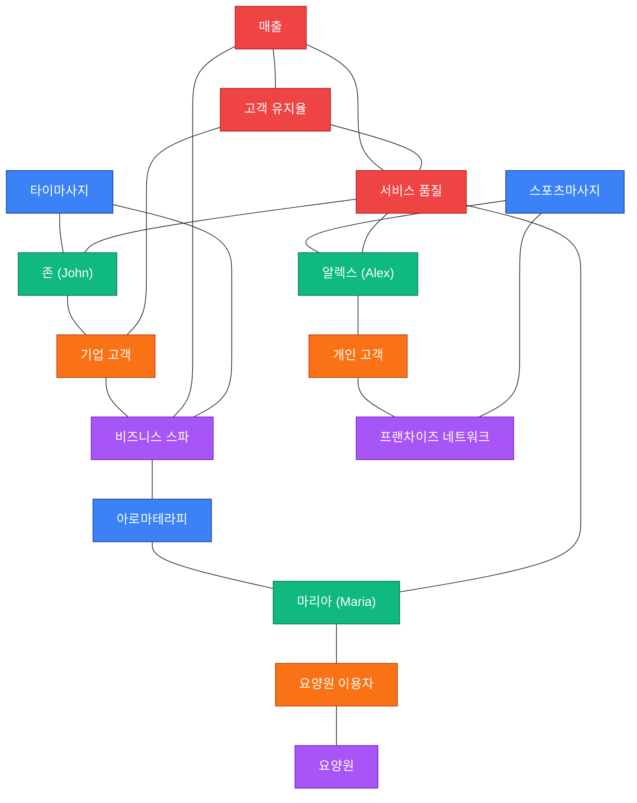

# 🕸️ ElSpa 앱 지식 네트워크 — Obsidian 버전

> 앱의 `/admin/knowledge-network` · `/network-graph` 데모 데이터(15노드)를 Obsidian 그래프로 옮긴 것.
> `Cmd+G` 그래프 뷰에서 카테고리별로 연결된 네트워크가 보입니다.

**노드 15 · 엣지 20**

## 🔵 서비스 (3)
- [[타이마사지]]
- [[아로마테라피]]
- [[스포츠마사지]]

## 🟢 치료사 (3)
- [[존 (John)]]
- [[마리아 (Maria)]]
- [[알렉스 (Alex)]]

## 🟠 고객 (3)
- [[기업 고객]]
- [[요양원 이용자]]
- [[개인 고객]]

## 🟣 조직 (3)
- [[비즈니스 스파]]
- [[요양원]]
- [[프랜차이즈 네트워크]]

## 🔴 KPI (3)
- [[매출]]
- [[고객 유지율]]
- [[서비스 품질]]

## 🗺️ 네트워크 미리보기 (Mermaid)

> 🔵서비스 🟢치료사 🟠고객 🟣조직 🔴KPI

---
← [[🧠-KNOWLEDGE-NETWORK-OBSIDIAN]] (문서 지식맵)
